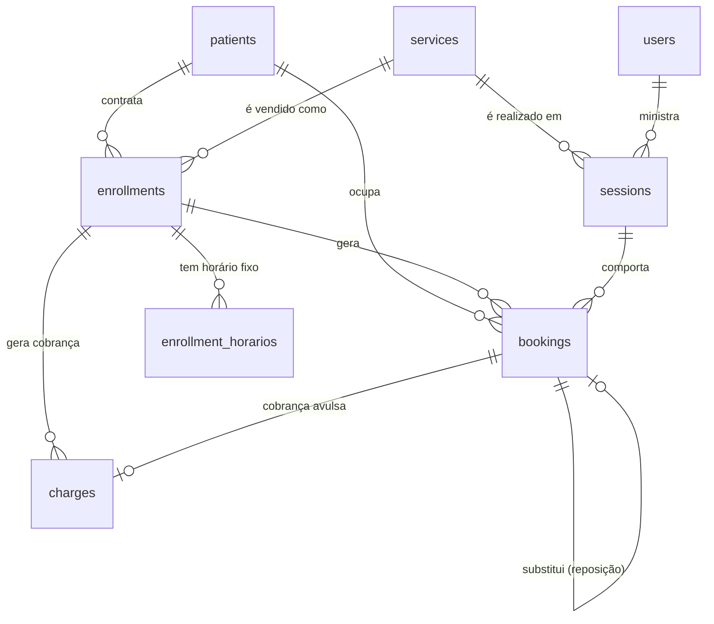

# Modelo de dados

Revisão do modelo após as confirmações da cliente. Cobre os **dois modelos de
cobrança** (mensalidade e pacote) e o controle de capacidade.

Complementa o [CLAUDE.md](../CLAUDE.md), que traz as decisões em forma curta.
As premissas ainda não validadas estão em [premissas.md](premissas.md).

---

## O que mudou nesta revisão

| Antes | Agora | Por quê |
|---|---|---|
| Pilates 5, Fisio 1, Avaliação 1 | **4 em qualquer serviço** | Confirmado pela cliente (P1) |
| Fisioterapia individual | Fisioterapia **em turma** | Consequência do acima |
| Só mensalidade | Mensalidade **e** pacote de sessões | Fisioterapia é vendida por pacote (P3) |
| `enrollments.dia_semana` + `hora` | Tabela `enrollment_horarios` | 2x/semana são **dois** horários, não um |
| Segunda a sexta | Sábado incluído | Confirmado (P6) |
| Reposição justificada (regra fixa) | Regra em **configuração** | Contradição em aberto (P5) |
| `bookings.remarcado_de_id` | `bookings.substitui_booking_id` | Mesma coluna; o nome antigo dizia "remarcação" mas ela também guarda reposição |

---

## Visão geral



Três níveis, e é a decisão central:

- **`enrollments`** — o **contrato**. O que o paciente comprou.
- **`sessions`** — a **ocorrência**. Esta aula, com este instrutor, neste
  horário, com esta capacidade.
- **`bookings`** — o **vínculo** de um paciente com uma ocorrência. É aqui que
  vivem presença, falta, cancelamento e reposição.

Turma com capacidade, falta de uma pessoa só, reposição e os dois modelos de
cobrança saem todos desse mesmo modelo, sem caso especial.

---

## Os dois modelos de cobrança

O discriminador é `enrollments.tipo`. Um contrato é mensalidade **ou** pacote,
nunca os dois.

|  | **Mensalidade** (Pilates) | **Pacote** (Fisioterapia) |
|---|---|---|
| O que o paciente compra | Horário fixo semanal, por mês | N sessões, com validade |
| Cobrança | Uma por mês de referência | Uma só, na compra |
| Valor | Fixo, independe de presença | Fixo, independe de presença |
| Falta desconta? | **Não** (confirmado) | **Configurável** — ver P5 |
| Como as sessões nascem | Geradas da grade semanal | Marcadas uma a uma |
| Fim do contrato | `vigencia_fim` ou encerramento | Saldo zerado ou validade vencida |

**Sessão avulsa e avaliação** não são contrato: são um `booking` sem
`enrollment_id`, com uma `charge` ligada diretamente à reserva.

### Por que um discriminador e não duas tabelas

Duplicar `enrollments` em `matriculas_mensais` e `pacotes` duplicaria também
tudo que é comum — paciente, serviço, vigência, status — e o serviço de
agendamento teria de tratar os dois casos em toda consulta de saldo e de
elegibilidade para reposição. O que difere entre os dois são **três colunas**;
o que é igual é o resto.

O custo dessa escolha é que colunas de um tipo ficam `NULL` no outro. Isso é
contido por `CHECK` no banco: uma matrícula de mensalidade **exige**
`valor_mensal_centavos` e **proíbe** `total_sessoes`, e vice-versa. O banco
recusa um híbrido, então "nulo" nunca vira ambiguidade.

---

## Tabelas

Convenção: tabelas em inglês (já estabelecidas), colunas em português.
Dinheiro sempre em **centavos**, inteiro. Tempo sempre `TIMESTAMPTZ`.

### `services` — o que o studio vende

```
id
nome                        Pilates Solo, Fisioterapia, Avaliação
duracao_min
preco_centavos              preço de referência da sessão avulsa
capacidade_padrao           DEFAULT 4  (confirmado — P1)
cor                         para a legenda da agenda
modalidade_cobranca         mensalidade | pacote | avulsa
pacote_sessoes              NULL exceto quando modalidade = pacote  (P3)
pacote_validade_dias        NULL exceto quando modalidade = pacote  (P3)
ativo
```

`pacote_sessoes`, `pacote_validade_dias` e `preco_centavos` são **cadastro**,
não constante. Nenhum valor real foi chutado: o seed usa números
obviamente fictícios e comentados, porque a cliente ainda não respondeu (P3).

### `enrollments` — o contrato

```
id
patient_id                  → patients
service_id                  → services
professional_id             → users, NULL permitido
tipo                        mensalidade | pacote
status                      ativa | suspensa | encerrada
vigencia_inicio
vigencia_fim                NULL = sem prazo definido

-- só mensalidade
valor_mensal_centavos

-- só pacote
total_sessoes
valor_total_centavos
validade_ate
```

**Snapshot de propósito:** o valor e o número de sessões são copiados do
serviço no momento da contratação, não lidos do serviço na hora de cobrar.
Reajustar o preço de um serviço **não pode** alterar retroativamente o que
alguém já comprou.

`CHECK`: `tipo = 'mensalidade'` exige `valor_mensal_centavos NOT NULL` e
`total_sessoes IS NULL`; `tipo = 'pacote'` exige o inverso.

### `enrollment_horarios` — o horário fixo semanal

```
id
enrollment_id               → enrollments
dia_semana                  0=domingo … 6=sábado
hora_inicio
```

Uma linha por horário. **2x/semana são duas linhas.**

A frequência semanal é `COUNT(*)` — derivada, nunca armazenada. Guardar um
campo `frequencia` permitiria que ele discordasse do número de linhas, e
alguém acabaria pagando por 3x tendo 2 horários.

Só faz sentido para `tipo = mensalidade`. Se o pacote também tiver horário
fixo — pergunta aberta em P3 — a tabela já serve, sem mudança.

### `sessions` — a ocorrência

```
id
service_id                  → services
professional_id             → users, NOT NULL          (decisão firme)
inicia_em, termina_em       TIMESTAMPTZ
capacidade                  cópia de services.capacidade_padrao, com override
status                      agendada | realizada | cancelada
observacoes
```

`capacidade` é **copiada** do serviço, não lida por join. Mudar a capacidade
padrão de um serviço não pode reconfigurar em silêncio sessões que já têm
gente marcada — a recepção precisa remanejar antes (ver ressalva em P1).

`professional_id` é `NOT NULL`: sem ele o perfil de instrutor não tem o que
ler, e a agenda não sabe dizer de quem é a turma.

### `bookings` — a reserva

```
id
session_id                  → sessions
patient_id                  → patients
enrollment_id               → enrollments, NULL para avulsa/avaliação
origem                      recorrente | avulsa | reposicao | remarcacao
status                      agendada | confirmada | presente | falta | cancelada

justificada                 BOOLEAN DEFAULT false     -- só faz sentido com falta
motivo_justificativa        TEXT NULL

substitui_booking_id        → bookings, NULL
cancelado_em, motivo_cancelamento
criado_por_id               → users     -- auditoria: quem marcou
criado_em
```

**`status` é só presença.** Pagamento vive em `charges`. Os dois eixos são
independentes e nunca se combinam num estado só.

**`substitui_booking_id`** aponta da reserva nova para a falta que ela está
cobrindo. Serve tanto para reposição quanto para remarcação — `origem` diz
qual dos dois. O nome anterior (`remarcado_de_id`) sugeria só remarcação.

**`justificada` existe independentemente da regra vigente.** Mesmo que a
cliente confirme a leitura (a) de P5 — repor sem justificativa — o campo
continua registrando o julgamento da recepção, e voltar atrás não exige
migration.

### `charges` — a cobrança

```
id
patient_id                  → patients
enrollment_id               → enrollments, NULL para avulsa
booking_id                  → bookings, NULL exceto avulsa/avaliação
tipo                        mensalidade | pacote | avulsa
descricao
mes_referencia              DATE (dia 1), NULL exceto mensalidade
valor_centavos
vencimento
status                      pendente | pago | cancelado
pago_em, forma_pagamento
registrado_por_id           → users
```

**`vencido` não é status.** É `status = 'pendente' AND vencimento < hoje`,
calculado na consulta. Um status gravado exigiria um job à meia-noite e
mentiria até ele rodar.

### `horarios_funcionamento` — quando o studio abre

```
dia_semana                  0..6, chave primária
aberto                      BOOLEAN
hora_abertura, hora_fechamento
```

Seed: segunda a **sábado** 06:00–21:00, domingo fechado. Habilitar ou ajustar
um dia é **editar uma linha** — sem migration, sem deploy. A janela do sábado
é a dos dias úteis provisoriamente, pendente em P6.

### `configuracao` — regra de negócio que a cliente pode mudar

Linha única (`CHECK (id = 1)`).

```
cancelamento_antecedencia_horas    DEFAULT 24            (P4)
reposicao_exige_justificativa      DEFAULT true          (P5, leitura b)
reposicao_prazo_mesmo_mes          DEFAULT true          (P5)
falta_consome_sessao_do_pacote     DEFAULT false         (P3/P5)
```

Estes quatro registros são o que permite a contradição de P5 ser resolvida sem
migration. Nenhum deles existe como constante em código.

### `audit_log`

```
id, user_id, entidade, entidade_id, acao, dados (JSONB), criado_em
```

Exigência de LGPD e rastro de quem alterou agenda e pagamento.

---

## Onde a capacidade é verificada

O ponto central, dada a hipótese de P10. **Três** lugares, não um:

### 1. Ao criar qualquer reserva

Inclui **reposição**, sem exceção. Não existe caminho que fure o limite.

```sql
SELECT ... FROM sessions WHERE id = :id FOR UPDATE;   -- trava a linha
SELECT count(*) FROM bookings
 WHERE session_id = :id AND status <> 'cancelada';
-- só então insere
```

O `FOR UPDATE` não é preciosismo: duas recepcionistas podem reservar a última
vaga ao mesmo tempo. Sem a trava, as duas contam 3 de 4 e as duas inserem.
Coberto por teste de concorrência na Fase 3.

### 2. Ao criar ou alterar um horário de matrícula

**Este é o que a hipótese de P10 sozinha não cobriria.** Se cinco pessoas têm
horário fixo às segundas 08:00 e a capacidade é 4, **toda ocorrência nasce
lotada** e nenhuma reposição está envolvida — o overbooking foi vendido no
balcão, meses antes.

Antes de gravar um `enrollment_horarios`, o sistema conta as matrículas ativas
naquele mesmo serviço, dia e hora, e recusa se já houver `capacidade`.

### 3. Ao reduzir a capacidade de um serviço ou sessão

Não remove reservas existentes — apenas avisa quais sessões ficaram acima do
novo limite, para a recepção remanejar. Remover reserva automaticamente
decidiria por conta própria quem perde a vaga.

### Ordem de geração importa

As reservas recorrentes precisam existir **antes** de uma reposição ser
oferecida naquele horário. Se a grade for materializada por demanda, um
horário pode parecer livre, receber a reposição, e depois ser preenchido pelo
gerador de recorrência — recriando o overbooking pelo caminho oposto.

Por isso o gerador da Fase 4 materializa com semanas de antecedência e
**respeita reservas já existentes** em vez de assumir a sessão vazia.

---

## Valores derivados — calculados, nunca armazenados

| Valor | Como sai |
|---|---|
| Idade do paciente | de `data_nascimento` |
| Última visita | `MAX(sessions.inicia_em)` com booking `presente` |
| Total de sessões | `COUNT` de bookings `presente` |
| **Vagas livres** | `sessions.capacidade − COUNT(bookings ativas)` |
| Frequência semanal | `COUNT(enrollment_horarios)` |
| Cobrança vencida | `status = 'pendente' AND vencimento < hoje` |
| **Saldo do pacote** | ver abaixo |
| **Reposições pendentes** | ver abaixo |

### Saldo do pacote

```
consumidas = bookings 'presente'
           + bookings 'falta'  SE configuracao.falta_consome_sessao_do_pacote
reservadas = bookings 'agendada' ou 'confirmada' no futuro
saldo      = total_sessoes − consumidas − reservadas
```

**`reservadas` entra na conta de propósito.** Sem isso, um paciente com pacote
de 10 poderia ter 15 sessões marcadas: cada agendamento olharia só o que já
foi realizado.

### Reposições pendentes

Uma falta gera direito a reposição quando:

```
status = 'falta'
  AND (NOT configuracao.reposicao_exige_justificativa OR justificada)
  AND NOT EXISTS (outro booking com substitui_booking_id = esta falta)
  AND (NOT configuracao.reposicao_prazo_mesmo_mes OR ainda estamos no mês)
```

É uma consulta com `NOT EXISTS` — nada é armazenado, nada sai de sincronia.
É o que hoje vive na cabeça da Dra. Belanir.

---

## Índices e restrições

**Unicidade que protege regra de negócio:**

```sql
-- mesma pessoa duas vezes na mesma sessão
UNIQUE (session_id, patient_id) WHERE status <> 'cancelada';

-- mensalidade cobrada duas vezes no mesmo mês
UNIQUE (enrollment_id, mes_referencia)
  WHERE tipo = 'mensalidade' AND status <> 'cancelado';

-- pacote cobrado duas vezes
UNIQUE (enrollment_id) WHERE tipo = 'pacote' AND status <> 'cancelado';

-- uma falta reposta duas vezes
UNIQUE (substitui_booking_id) WHERE substitui_booking_id IS NOT NULL;
```

O último é o que impede a reposição de virar porta de entrada para
overbooking por outra via: mesmo com vaga, uma falta gera **uma** reposição.

**Índices de consulta:**

```sql
sessions (inicia_em)                        -- grade da semana
sessions (professional_id, inicia_em)       -- agenda do instrutor
bookings (session_id)                       -- contagem de ocupação
bookings (patient_id, status)               -- histórico e faltas pendentes
charges  (status, vencimento)               -- filtros do Financeiro
enrollment_horarios (dia_semana, hora_inicio)
patients (lower(nome_completo)) GIN trigram -- busca por nome
```

**Checagens:**

```sql
CHECK (sessions.termina_em > sessions.inicia_em)
CHECK (sessions.capacidade > 0)
CHECK (charges.valor_centavos >= 0)
CHECK (enrollments.tipo = 'mensalidade')  -- coerência dos campos por tipo
CHECK (configuracao.id = 1)
```

**Avaliado e adiado:** `EXCLUDE USING gist` para impedir o mesmo instrutor em
duas sessões sobrepostas. Exige a extensão `btree_gist`. Fica para a Fase 3,
quando houver dado real para validar contra — a alternativa é checar no
serviço, o que já cobre o caso normal.

---

## O que este modelo deliberadamente não faz

- **Não permite furar a capacidade.** Não existe "encaixar mesmo assim". Um
  sistema que documenta o overbooking em vez de impedi-lo não resolve a dor
  principal da cliente (P11).
- **Não infere "justificada".** É julgamento humano; a recepção marca.
- **Não guarda contador de vagas.** Sai de sincronia no primeiro cancelamento
  concorrente.
- **Não guarda dado clínico.** Fora do escopo, e sensível sob a LGPD.
