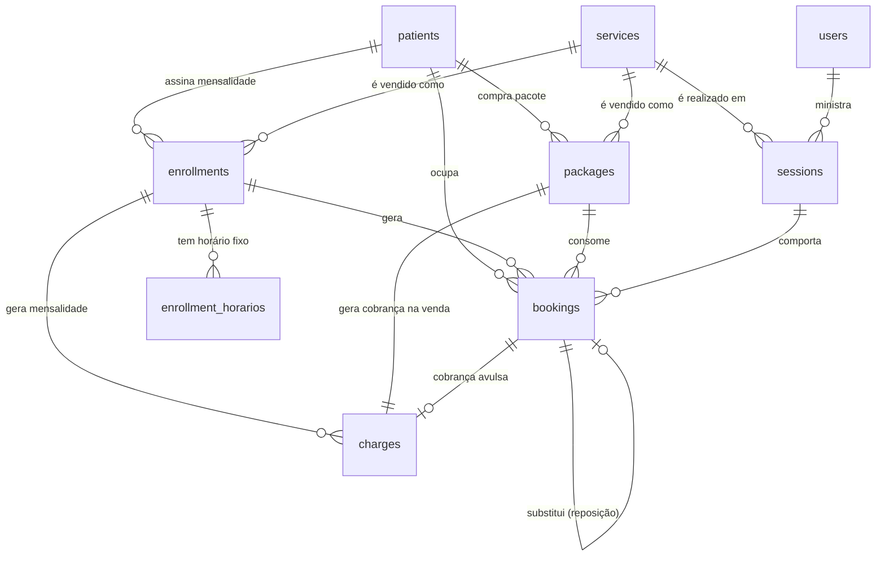

# Modelo de dados

Revisão do modelo após as confirmações da cliente. Cobre os **dois modelos de
cobrança** (mensalidade e pacote) e o controle de capacidade.

Complementa o [CLAUDE.md](../CLAUDE.md), que traz as decisões em forma curta.
As premissas ainda não validadas estão em [premissas.md](premissas.md).

---

## O que mudou nesta revisão

| Antes | Agora | Por quê |
|---|---|---|
| Pilates 5, Fisio 1, Avaliação 1 | **4 em qualquer serviço** | Confirmado pela cliente (P1) |
| Fisioterapia individual | Fisioterapia **em turma** | Consequência do acima |
| Só mensalidade | Mensalidade **e** pacote de sessões | Fisioterapia é vendida por pacote (P3) |
| `enrollments.dia_semana` + `hora` | Tabela `enrollment_horarios` | 2x/semana são **dois** horários, não um |
| Segunda a sexta | Sábado incluído | Confirmado (P6) |
| Reposição justificada (regra fixa) | Regra em **configuração** | Contradição em aberto (P5) |
| `bookings.remarcado_de_id` | `bookings.substitui_booking_id` | Mesma coluna; o nome antigo dizia "remarcação" mas ela também guarda reposição |
| Pacote como `enrollments.tipo` | Tabela `packages` própria | Pacote é **negociado por venda**, não cadastrado (P3) |
| `services.pacote_*` obrigatório | `services.sugestao_pacote_*` | Vira sugestão para pré-preencher, nunca fonte de verdade |
| Saldo desconta reservas futuras | Só desconta `presente` | Decisão da cliente (P5) |

---

## Visão geral



Três níveis, e é a decisão central:

- **`enrollments`** — o **contrato**. O que o paciente comprou.
- **`sessions`** — a **ocorrência**. Esta aula, com este instrutor, neste
  horário, com esta capacidade.
- **`bookings`** — o **vínculo** de um paciente com uma ocorrência. É aqui que
  vivem presença, falta, cancelamento e reposição.

Turma com capacidade, falta de uma pessoa só, reposição e os dois modelos de
cobrança saem todos desse mesmo modelo, sem caso especial.

---

## Os dois modelos de cobrança

São **duas entidades separadas**, não um discriminador. Cada uma tem sua
própria natureza:

|  | **`enrollments`** — Mensalidade | **`packages`** — Pacote |
|---|---|---|
| Serviço típico | Pilates | Fisioterapia |
| O que o paciente compra | Horário fixo semanal, por mês | N sessões negociadas |
| Quem define os valores | Tabela de preços do serviço | **A doutora, no ato da venda** |
| Cobrança | Uma por mês de referência | **Uma só, na venda** |
| Falta desconta? | Não (P2) | **Não** (P5) |
| Como as sessões nascem | Geradas da grade semanal | Marcadas uma a uma |
| Fim do contrato | `vigencia_fim` ou encerramento | Saldo zerado **ou validade vencida** |

**Sessão avulsa e avaliação** não são contrato: são um `booking` sem
`enrollment_id` nem `package_id`, com uma `charge` ligada à reserva.

### Por que duas tabelas, e não um discriminador

A revisão anterior deste documento propunha `enrollments.tipo` com colunas
nulas conforme o caso. **A mudança para pacote negociado por venda derrubou
esse desenho**, e para melhor.

Um pacote não é um contrato recorrente: não tem horário fixo, não tem
vigência mensal, não gera cobrança periódica. O que ele tem — sessões
contratadas, validade, data da compra — não existe na mensalidade. Sobravam
mais colunas exclusivas do que compartilhadas, e o `CHECK` que impedia o
híbrido era sintoma de que as duas coisas nunca foram uma só.

Com tabelas separadas, some o discriminador, some o `CHECK` de coerência e
some toda coluna nula por construção.

**Custo da escolha:** `bookings` precisa apontar para os dois, com
`enrollment_id` e `package_id` nuláveis e um `CHECK` de que no máximo um está
preenchido. É uma restrição só, num lugar só — mais barata que colunas nulas
espalhadas por duas naturezas diferentes de contrato.

### Snapshot: o pacote nunca relê o serviço

Depois de vendido, um pacote **não lê preço nem quantidade do serviço**. Os
valores foram capturados no ato e ficam.

Isso não é preciosismo: a doutora vai reajustar a sugestão de preço, e no dia
em que fizer isso, todo pacote já vendido tem de continuar valendo o que foi
combinado com o paciente. O mesmo princípio já vale em
`enrollments.valor_mensal_centavos`.

`services.sugestao_pacote_*` serve **exclusivamente** para pré-preencher o
formulário de venda. Todos os campos ficam editáveis, e nada é obrigatório.

## Tabelas

Convenção: tabelas em inglês (já estabelecidas), colunas em português.
Dinheiro sempre em **centavos**, inteiro. Tempo sempre `TIMESTAMPTZ`.

### `services` — o que o studio vende

```
id
nome                          Pilates, Fisioterapia, Avaliação
duracao_min
preco_centavos                preço de referência da sessão avulsa
capacidade_padrao             4 em turma, 1 na avaliação   (P1)
cor                           para a legenda da agenda
modelo_cobranca               mensalidade | pacote

-- sugestões, só quando modelo_cobranca = pacote (P3)
sugestao_pacote_sessoes       NULL
sugestao_pacote_validade_dias NULL
sugestao_pacote_valor_centavos NULL

ativo
```

**Os três campos `sugestao_*` nunca são fonte de verdade.** Existem para
pré-preencher o formulário de venda e nada mais. Toda leitura de valor de um
pacote vendido vem de `packages`.

`CHECK`: os `sugestao_*` só podem estar preenchidos quando
`modelo_cobranca = 'pacote'`. Isso é validado no banco **e** no schema de
entrada — esconder o campo na tela não é validação.

### `enrollments` — a mensalidade

```
id
patient_id                  → patients
service_id                  → services
professional_id             → users, NULL permitido
status                      ativa | suspensa | encerrada
vigencia_inicio
vigencia_fim                NULL = sem prazo definido
valor_mensal_centavos       snapshot no momento da contratação
```

Sem discriminador: `enrollments` é **só mensalidade**. Pacote é `packages`.

O valor é copiado no momento da contratação e nunca relido do serviço.
Reajuste de tabela não altera retroativamente o que alguém já assinou.

### `enrollment_horarios` — o horário fixo semanal

```
id
enrollment_id               → enrollments
dia_semana                  0=domingo … 6=sábado
hora_inicio
```

Uma linha por horário. **2x/semana são duas linhas.**

A frequência semanal é `COUNT(*)` — derivada, nunca armazenada. Guardar um
campo `frequencia` permitiria que ele discordasse do número de linhas, e
alguém acabaria pagando por 3x tendo 2 horários.

Só faz sentido para `tipo = mensalidade`. Se o pacote também tiver horário
fixo — pergunta aberta em P3 — a tabela já serve, sem mudança.

### `packages` — o pacote vendido

Cada linha é **uma venda**, negociada caso a caso pela doutora.

```
id
patient_id                  → patients
service_id                  → services
sessoes_contratadas         negociado no ato
valor_centavos              negociado no ato
validade_ate                DATE NULL — em branco = vale até acabar
comprado_em                 DATE
registrado_por_id           → users        auditoria de quem vendeu
status                      ativo | encerrado | cancelado
```

**Tudo aqui é snapshot.** Nada é lido de `services` depois da venda.

`validade_ate` nulo é caso normal, não dado faltando: significa "vale até
acabar o saldo".

**Não há coluna de saldo** — ver a seção de valores derivados.

### `sessions` — a ocorrência

```
id
service_id                  → services
professional_id             → users, NOT NULL          (decisão firme)
inicia_em, termina_em       TIMESTAMPTZ
capacidade                  cópia de services.capacidade_padrao, com override
status                      agendada | realizada | cancelada
observacoes
```

`capacidade` é **copiada** do serviço, não lida por join. Mudar a capacidade
padrão de um serviço não pode reconfigurar em silêncio sessões que já têm
gente marcada — a recepção precisa remanejar antes (ver ressalva em P1).

`professional_id` é `NOT NULL`: sem ele o perfil de instrutor não tem o que
ler, e a agenda não sabe dizer de quem é a turma.

### `bookings` — a reserva

```
id
session_id                  → sessions
patient_id                  → patients
enrollment_id               → enrollments, NULL se não for mensalidade
package_id                  → packages,    NULL se não for pacote
origem                      recorrente | avulsa | reposicao | remarcacao
status                      agendada | confirmada | presente | falta | cancelada

justificada                 BOOLEAN DEFAULT false     -- só faz sentido com falta
motivo_justificativa        TEXT NULL

substitui_booking_id        → bookings, NULL
cancelado_em, motivo_cancelamento
criado_por_id               → users     -- auditoria: quem marcou
criado_em
```

`CHECK`: no máximo um entre `enrollment_id` e `package_id` preenchido. Os
dois nulos é o caso da sessão avulsa e da avaliação.

**`status` é só presença.** Pagamento vive em `charges`. Os dois eixos são
independentes e nunca se combinam num estado só.

**`substitui_booking_id`** aponta da reserva nova para a falta que ela está
cobrindo. Serve tanto para reposição quanto para remarcação — `origem` diz
qual dos dois. O nome anterior (`remarcado_de_id`) sugeria só remarcação.

**`justificada` existe independentemente da regra vigente.** Mesmo que a
cliente confirme a leitura (a) de P5 — repor sem justificativa — o campo
continua registrando o julgamento da recepção, e voltar atrás não exige
migration.

### `charges` — a cobrança

```
id
patient_id                  → patients
enrollment_id               → enrollments, NULL exceto mensalidade
package_id                  → packages,    NULL exceto pacote
booking_id                  → bookings,    NULL exceto avulsa/avaliação
tipo                        mensalidade | pacote | avulsa
descricao
mes_referencia              DATE (dia 1), NULL exceto mensalidade
valor_centavos
vencimento
status                      pendente | pago | cancelado
pago_em, forma_pagamento
registrado_por_id           → users
```

A cobrança do pacote **nasce no ato da venda**, com o valor negociado — uma
só, não mensal.

**`vencido` não é status.** É `status = 'pendente' AND vencimento < hoje`,
calculado na consulta. Um status gravado exigiria um job à meia-noite e
mentiria até ele rodar.

### `horarios_funcionamento` — quando o studio abre

```
dia_semana                  0..6, chave primária
aberto                      BOOLEAN
hora_abertura, hora_fechamento
pausa_inicio, pausa_fim     NULL se não houver pausa
```

Seed confirmado (P6): **segunda a sábado, 06:00–21:00, pausa 12:00–14:00**;
domingo fechado. O sábado tem a mesma janela dos dias úteis.

Ajustar qualquer dia é **editar uma linha** — sem migration, sem deploy. Por
isso a pausa é por dia e não global: se um dia tiver janela diferente, já
cabe.

### `configuracao` — regra de negócio que a cliente pode mudar

Linha única (`CHECK (id = 1)`).

```
cancelamento_antecedencia_horas    24       ⏳ não validado        (P4)
reposicao_exige_justificativa      true     ✅ confirmado          (P5)
reposicao_prazo_mesmo_mes          true     ⏳ não validado        (P5)
falta_consome_sessao_do_pacote     false    ✅ confirmado          (P5)
```

Nenhum destes existe como constante em código. A contradição de P5 foi
resolvida por aqui, sem migration — e o mecanismo fica para a próxima vez.

**Não há tela de configuração nesta entrega.** Os valores vêm do seed e se
mudam por comando ou SQL. Uma tela simples pode entrar na Fase 6, se sobrar
tempo — agenda funcionando vale mais que painel de ajustes.

### `audit_log`

```
id, user_id, entidade, entidade_id, acao, dados (JSONB), criado_em
```

Exigência de LGPD e rastro de quem alterou agenda e pagamento.

---

## Onde a capacidade é verificada

O ponto central, dada a hipótese de P10. **Três** lugares, não um:

### 1. Ao criar qualquer reserva

Inclui **reposição**, sem exceção. Não existe caminho que fure o limite.

```sql
SELECT ... FROM sessions WHERE id = :id FOR UPDATE;   -- trava a linha
SELECT count(*) FROM bookings
 WHERE session_id = :id AND status <> 'cancelada';
-- só então insere
```

O `FOR UPDATE` não é preciosismo: duas recepcionistas podem reservar a última
vaga ao mesmo tempo. Sem a trava, as duas contam 3 de 4 e as duas inserem.
Coberto por teste de concorrência na Fase 3.

### 2. Ao criar ou alterar um horário de matrícula

**Este é o que a hipótese de P10 sozinha não cobriria.** Se cinco pessoas têm
horário fixo às segundas 08:00 e a capacidade é 4, **toda ocorrência nasce
lotada** e nenhuma reposição está envolvida — o overbooking foi vendido no
balcão, meses antes.

Antes de gravar um `enrollment_horarios`, o sistema conta as matrículas ativas
naquele mesmo serviço, dia e hora, e recusa se já houver `capacidade`.

### 3. Ao reduzir a capacidade de um serviço ou sessão

Não remove reservas existentes — apenas avisa quais sessões ficaram acima do
novo limite, para a recepção remanejar. Remover reserva automaticamente
decidiria por conta própria quem perde a vaga.

### Ordem de geração importa

As reservas recorrentes precisam existir **antes** de uma reposição ser
oferecida naquele horário. Se a grade for materializada por demanda, um
horário pode parecer livre, receber a reposição, e depois ser preenchido pelo
gerador de recorrência — recriando o overbooking pelo caminho oposto.

Por isso o gerador da Fase 4 materializa com semanas de antecedência e
**respeita reservas já existentes** em vez de assumir a sessão vazia.

---

## Valores derivados — calculados, nunca armazenados

| Valor | Como sai |
|---|---|
| Idade do paciente | de `data_nascimento` |
| Última visita | `MAX(sessions.inicia_em)` com booking `presente` |
| Total de sessões | `COUNT` de bookings `presente` |
| Idade | de `data_nascimento` — nunca coluna `idade` |
| **Vagas livres** | `sessions.capacidade − COUNT(bookings ativas)` |
| Frequência semanal | `COUNT(enrollment_horarios)` |
| Cobrança vencida | `status = 'pendente' AND vencimento < hoje` |
| **Saldo do pacote** | `sessoes_contratadas − COUNT(bookings 'presente')` |
| Pacote utilizável | saldo > 0 **e** dentro da validade |
| **Reposições pendentes** | ver abaixo |

### Saldo do pacote

> **Definição precisa, e ela importa:**
> **Só reserva com status `presente` consome sessão do saldo.**
> `agendada`, `confirmada`, `cancelada` e `falta` **não** consomem.

```sql
saldo = packages.sessoes_contratadas
      - COUNT(bookings WHERE package_id = :id AND status = 'presente')
```

É só isso. Nenhuma outra condição.

Esta definição está isolada em **uma única função** no serviço de pacotes,
com teste dedicado para cada status. É o tipo de regra que alguém "melhora"
sem perceber ao escrever uma consulta nova — por isso não se repete a
contagem em lugar nenhum.

**Por que `falta` não consome:** decisão da cliente (P5). O paciente que
faltou repõe sem perder a sessão comprada.

**Por que `agendada` não consome:** uma revisão anterior deste documento
propunha que reservas futuras segurassem saldo, para impedir marcar 15
sessões num pacote de 10. A cliente decidiu o contrário: o saldo só cai
quando a sessão acontece.

**Efeito colateral aceito:** é possível ter mais sessões marcadas do que o
saldo comprado. Na prática a recepção vê o saldo na tela ao marcar, e a
validade limita. Se incomodar, somar as reservas futuras é mudança de uma
função — sem migration.

### A validade é a única trava do pacote

Consequência direta de falta não consumir saldo: **um paciente que falta muito
mantém o saldo intacto indefinidamente.** Sem validade, o pacote nunca termina.

Por isso:

```sql
pacote_utilizavel = status = 'ativo'
                AND saldo > 0
                AND (validade_ate IS NULL OR validade_ate >= CURRENT_DATE)
```

Toda consulta de saldo passa por essa condição — nunca só por `saldo > 0`.

**Regra de tela, não só de banco:** saldo e data de expiração aparecem
**sempre juntos**. Mostrar "restam 4 sessões" sem dizer que o pacote venceu
ontem dá à recepção a impressão errada de que ainda dá para agendar, e ela vai
prometer ao paciente algo que o sistema depois recusa.

### Reposições pendentes

Uma falta gera direito a reposição quando:

```
status = 'falta'
  AND (NOT configuracao.reposicao_exige_justificativa OR justificada)
  AND NOT EXISTS (outro booking com substitui_booking_id = esta falta)
  AND (NOT configuracao.reposicao_prazo_mesmo_mes OR ainda estamos no mês)
```

É uma consulta com `NOT EXISTS` — nada é armazenado, nada sai de sincronia.
É o que hoje vive na cabeça da Dra. Belanir.

---

## Índices e restrições

**Unicidade que protege regra de negócio:**

```sql
-- mesma pessoa duas vezes na mesma sessão
UNIQUE (session_id, patient_id) WHERE status <> 'cancelada';

-- mensalidade cobrada duas vezes no mesmo mês
UNIQUE (enrollment_id, mes_referencia)
  WHERE tipo = 'mensalidade' AND status <> 'cancelado';

-- pacote cobrado duas vezes
UNIQUE (package_id) WHERE tipo = 'pacote' AND status <> 'cancelado';

-- uma falta reposta duas vezes
UNIQUE (substitui_booking_id) WHERE substitui_booking_id IS NOT NULL;
```

O último é o que impede a reposição de virar porta de entrada para
overbooking por outra via: mesmo com vaga, uma falta gera **uma** reposição.

**Índices de consulta:**

```sql
sessions (inicia_em)                        -- grade da semana
sessions (professional_id, inicia_em)       -- agenda do instrutor
bookings (session_id)                       -- contagem de ocupação
bookings (patient_id, status)               -- histórico e faltas pendentes
charges  (status, vencimento)               -- filtros do Financeiro
enrollment_horarios (dia_semana, hora_inicio)
patients (lower(nome_completo)) GIN trigram -- busca por nome
```

**Checagens:**

```sql
CHECK (sessions.termina_em > sessions.inicia_em)
CHECK (sessions.capacidade > 0)
CHECK (charges.valor_centavos >= 0)
CHECK (packages.sessoes_contratadas > 0)
CHECK (packages.valor_centavos >= 0)
-- uma reserva pertence a no máximo um contrato
CHECK (bookings.enrollment_id IS NULL OR bookings.package_id IS NULL)
-- sugestões de pacote só em serviço vendido como pacote
CHECK (services.modelo_cobranca = 'pacote' OR services.sugestao_pacote_sessoes IS NULL)
CHECK (configuracao.id = 1)
```

**Avaliado e adiado:** `EXCLUDE USING gist` para impedir o mesmo instrutor em
duas sessões sobrepostas. Exige a extensão `btree_gist`. Fica para a Fase 3,
quando houver dado real para validar contra — a alternativa é checar no
serviço, o que já cobre o caso normal.

---

## O que este modelo deliberadamente não faz

- **Não permite furar a capacidade.** Não existe "encaixar mesmo assim". Um
  sistema que documenta o overbooking em vez de impedi-lo não resolve a dor
  principal da cliente (P11).
- **Não infere "justificada".** É julgamento humano; a recepção marca.
- **Não guarda contador de vagas.** Sai de sincronia no primeiro cancelamento
  concorrente.
- **Não guarda dado clínico.** Fora do escopo, e sensível sob a LGPD. Isso
  inclui restrição, lesão e observação clínica — não adicione "só um campinho
  de observações médicas" a `patients`: muda a classificação de risco da
  tabela inteira.
- **Não guarda saldo de pacote.** É contagem, em query.
- **Não deixa o pacote reler o serviço** depois da venda.
